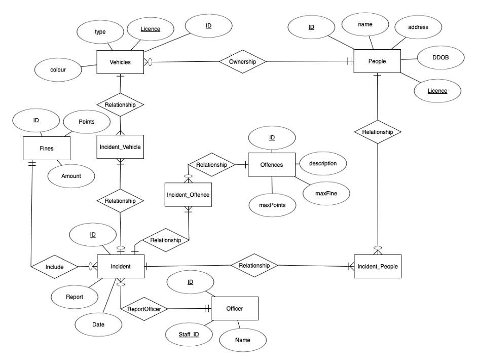
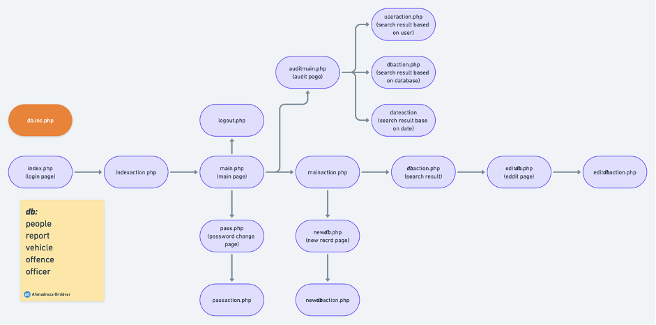
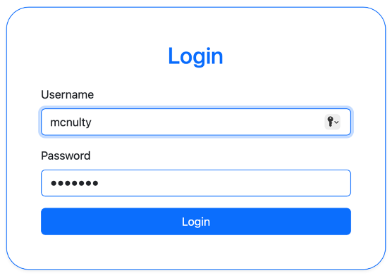
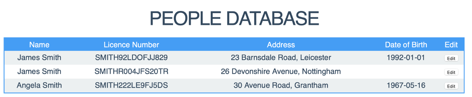
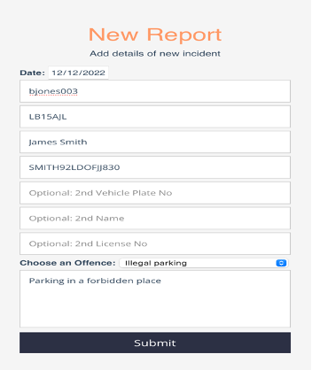
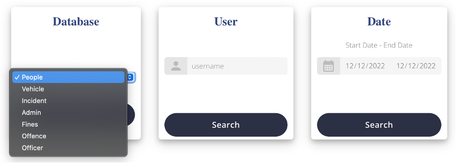
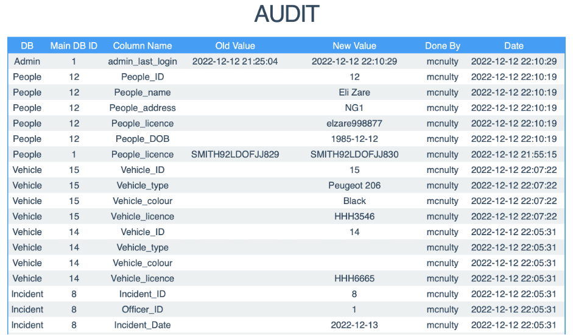

# Plice_Station_DB_Web
Police Station Database and Website Interface
DATABASES, INTERFACES AND SOFTWARE DESIGN PRINCIPLES  (COMP4039 UNUK) Project

## Introduction
UK traffic police is a website that helps police to keep records of people and vehicles that have come to their attention, with information such as vehicles, people, offences and reports.

## Database Design
The database design is based on the following ERD:

## Structure
The structure of the design is as per following. 

## How to use
Users should input his/her username and password on the login page to enter the website

## Audit Trail
The super-admin can see all database changes on the Audit page. A log can be searched by a database or user or a specific period 

